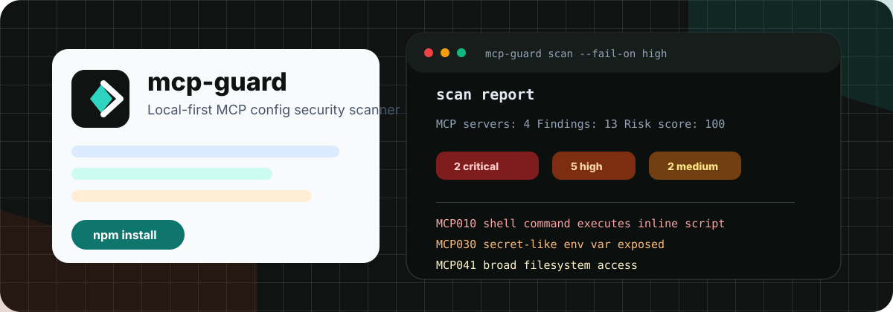

<p align="center">
  
</p>

# mcp-guard

Local-first security scanning for MCP and AI agent tool configs.

`mcp-guard` helps teams review what their AI agents can execute before those agents touch local files, shells, credentials, SaaS accounts, or production systems.

Website: [chaoyue0307.github.io/mcp-guard](https://chaoyue0307.github.io/mcp-guard/)

<p>
  <a href="https://www.npmjs.com/package/agent-mcp-guard"></a>
  <a href="https://github.com/ChaoYue0307/mcp-guard/actions"></a>
  <a href="LICENSE"></a>
  <a href="https://github.com/ChaoYue0307/mcp-guard/releases/tag/v0.2.0"></a>
</p>

## Install

```bash
npm install -g agent-mcp-guard
mcp-guard scan
```

Scan a specific config:

```bash
mcp-guard scan --config .mcp.json
```

Generate a Markdown report:

```bash
mcp-guard scan --format markdown --output mcp-guard-report.md
```

Generate an HTML report:

```bash
mcp-guard scan --format html --output mcp-guard-report.html
```

Use in CI:

```bash
mcp-guard scan --config .mcp.json --fail-on high
```

Use the GitHub Action:

```yaml
- uses: ChaoYue0307/mcp-guard@v0.2.0
  with:
    fail-on: high
```

## What It Finds

| Risk | Why it matters |
| --- | --- |
| Shell wrappers and inline scripts | Agent startup can become arbitrary code execution. |
| `npx`, `uvx`, `bunx`, `pnpm dlx` | Remote package execution expands supply-chain risk. |
| Unpinned packages | A trusted MCP server can change underneath you. |
| Secret-like env vars and headers | Long-lived tokens leak into tool runtimes and reports. |
| Broad filesystem access | Home, root, Desktop, Documents, and Downloads are high-blast-radius paths. |
| Remote MCP URLs | Data may leave the local trust boundary. |
| Dangerous command patterns | `rm -rf`, `sudo`, `chmod 777`, and curl-pipe-shell should block review. |

## Example Output

```text
mcp-guard scan report
Scanned files: 1
MCP servers: 3
Findings: 9
Risk score: 98
Critical: 2  High: 5  Medium: 2  Low: 0

- [CRITICAL] MCP010 Shell command executes inline script
- [HIGH] MCP021 Remote MCP package is not version pinned
- [HIGH] MCP030 Secret-like environment variable is exposed to MCP server
- [HIGH] MCP041 MCP server argument grants broad filesystem access
```

See the full sample report: [examples/sample-report.md](examples/sample-report.md)

## Supported Config Shape

```json
{
  "mcpServers": {
    "server-name": {
      "command": "npx",
      "args": ["@modelcontextprotocol/server-filesystem", "/path/to/project"],
      "env": {
        "API_KEY": "..."
      },
      "cwd": "/path/to/project"
    }
  }
}
```

`mcp-guard` supports the common `mcpServers` shape used by Claude Desktop, Cursor, and project-level MCP configs. It also accepts `servers` as an alternative top-level key.

## Why Local-First

MCP configs often contain sensitive local paths, internal hostnames, tokens, and workflow details. `mcp-guard` runs locally by default:

- no config upload;
- no external API call;
- secret-like values redacted in reports;
- text, Markdown, HTML, and JSON output for local review and CI.

## Commercial Support

Need help reviewing a real AI agent or MCP setup?

I offer private **AI Agent/MCP Security Audits** covering server inventory, risky startup commands, secret exposure, filesystem scope, remote MCP endpoints, and remediation planning.

Contact: [hechaoyue0307@gmail.com](mailto:hechaoyue0307@gmail.com)

Service details: [docs/paid-audit.md](docs/paid-audit.md)

## Documentation

- [Rule reference](docs/rules.md)
- [GitHub Action](docs/github-action.md)
- [Privacy and security](docs/privacy-and-security.md)
- [Roadmap](docs/roadmap.md)
- [Business playbook](docs/business-playbook.md)
- [Launch checklist](docs/launch-checklist.md)
- [Operator runbook](docs/operator-runbook.md)

## Exit Codes

- `0`: scan completed and did not hit the fail threshold.
- `1`: CLI usage or runtime error.
- `2`: finding severity met `--fail-on` threshold.

## Development

```bash
npm test
npm run release:check
```

## License

Apache-2.0
